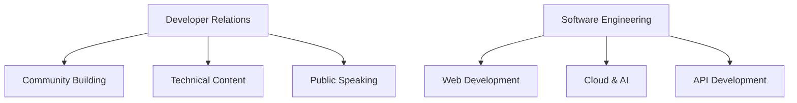

<div align="center">
  <h1>Sudhanshu Tiwari</h1>
  <h3>Software Engineer | Developer Relations | Community Builder</h3>
  
  <p>
    <a href="https://www.linkedin.com/in/sudhanshutiwari264/"></a>
    <a href="https://twitter.com/sudhanshutiwari"></a>
    <a href="https://medium.com/@sudhanshutiwari264"></a>
    <a href="mailto:sudhanshutiwari264@gmail.com"></a>
  </p>
  
  
  
  <p>
    
  </p>
</div>

<hr>

## 💫 About Me

I'm a **Developer Relations enthusiast** and **Software Engineer** passionate about creating exceptional developer experiences and fostering tech communities. Currently leading Developer Relations, Business Analysis, and Technical Initiatives at Formidium, I combine technical expertise with community engagement skills to build bridges between complex technologies and developer communities.

- 🎓 Pursuing B.Tech in Computer Science and Engineering with AI specialization at RTU, Kota (2021-2025)
- 🌱 Currently exploring **Cloud Computing**, **AI/ML**, and **Developer Experience**
- 🔭 Working on enhancing developer communities and creating technical content
- 📫 Portfolio: [View Portfolio](https://sudhanshu-portfolio-git-main-sudhanshu-tiwaris-projects.vercel.app/index.html)

<hr>

## 🚀 Professional Experience

<div align="center">



</div>

<hr>

## 🛠️ Technical Skills

<div align="center">
  <table border="0" cellspacing="0" cellpadding="0">
    <tr>
      <td>
        <h3 align="center">Languages & Frameworks</h3>
        <div align="center">
          
          
          
          
          
          
          
        </div>
      </td>
    </tr>
    <tr>
      <td>
        <h3 align="center">Tools & Platforms</h3>
        <div align="center">
          
          
          
          
          
          
          
        </div>
      </td>
    </tr>
  </table>
</div>

<hr>

## 🏆 Achievements & Metrics

<div align="center">
  <table>
    <tr>
      <td align="center">
        <h3>5+</h3>
        <p>Tech Events<br>Organized</p>
      </td>
      <td align="center">
        <h3>10+</h3>
        <p>Projects<br>Completed</p>
      </td>
      <td align="center">
        <h3>500+</h3>
        <p>Community<br>Members</p>
      </td>
      <td align="center">
        <h3>2+</h3>
        <p>Years Industry<br>Experience</p>
      </td>
    </tr>
  </table>
</div>

<hr>

## 📜 Certifications

<div align="center">
  <a href="#"></a>
  <a href="#"></a>
  <a href="#"></a>
  <a href="#"></a>
  <a href="#"></a>
</div>

<hr>

## 🔥 Featured Projects

<div align="center">
  <table>
    <tr>
      <td width="50%">
        <h3 align="center">SightEase</h3>
        <div align="center">
          <a href="https://github.com/sudhanshutiwari264/SightEase">
            
          </a>
        </div>
        <p align="center">AI-powered object detection application that helps visually impaired users navigate their environment.</p>
        <p align="center"><strong>Tech Stack:</strong> Python, Computer Vision, AI</p>
      </td>
      <td width="50%">
        <h3 align="center">Chat Application Database</h3>
        <div align="center">
          <a href="https://github.com/sudhanshutiwari264/Chat-Application-Database">
            
          </a>
        </div>
        <p align="center">A robust and structured data storage solution for a chat application.</p>
        <p align="center"><strong>Tech Stack:</strong> Database Design, SQL, HTML</p>
      </td>
    </tr>
    <tr>
      <td width="50%">
        <h3 align="center">Auth and Authorization</h3>
        <div align="center">
          <a href="https://github.com/sudhanshutiwari264/AuthAndAuthorization">
            
          </a>
        </div>
        <p align="center">Implementation of authentication and authorization systems for web applications.</p>
        <p align="center"><strong>Tech Stack:</strong> JavaScript, Security</p>
      </td>
      <td width="50%">
        <h3 align="center">OOP in Different Languages</h3>
        <div align="center">
          <a href="https://github.com/sudhanshutiwari264/Making-class-in-different-Programming-languages-">
            
          </a>
        </div>
        <p align="center">Educational repository showcasing how to implement classes across different programming languages.</p>
        <p align="center"><strong>Tech Stack:</strong> Multiple Languages, OOP</p>
      </td>
    </tr>
  </table>
</div>


## 📝 Latest Articles

<div align="center">
  <a href="https://medium.com/@sudhanshutiwari264/data-visualization-using-python-3a5683b0f5dc">
    
  </a>
  <a href="https://medium.com/@sudhanshutiwari264/navigating-the-data-communication-landscape-the-role-of-http-https-and-api-5cf998232d13">
    
  </a>
  <a href="https://www.linkedin.com/pulse/exploring-ram-linux-sudhanshu-tiwari/">
    
  </a>
  <a href="https://www.linkedin.com/pulse/how-use-espeak-ng-linux-sudhanshu-tiwari/">
    
  </a>
</div>

<hr>

## 👥 Community Involvement

<div align="center">
  <table>
    <tr>
      <td align="center">
        <h3>Event Organizer</h3>
        <p>Organized 5+ tech events including hackathons and workshops</p>
      </td>
      <td align="center">
        <h3>Speaker</h3>
        <p>Speaker at various tech events</p>
      </td>
    </tr>
    <tr>
      <td align="center">
        <h3>Community Leader</h3>
        <p>Built and managed communities with 500+ members</p>
      </td>
      <td align="center">
        <h3>Postman Student Leader</h3>
        <p>Leading Postman initiatives in academic communities</p>
      </td>
    </tr>
  </table>
</div>

<hr>

## 💻 Coding Activity

```javascript
function contribute() {
  const passion = "Open Source";
  const skills = ["JavaScript", "Python", "React"];
  
  return skills.map(skill => {
    return buildAwesomeProjects(skill, passion);
  });
}

// Committed to code that matters
contribute();
```

<hr>

<div align="center">
  
  <p>Let's connect and build something amazing together!</p>
</div>
